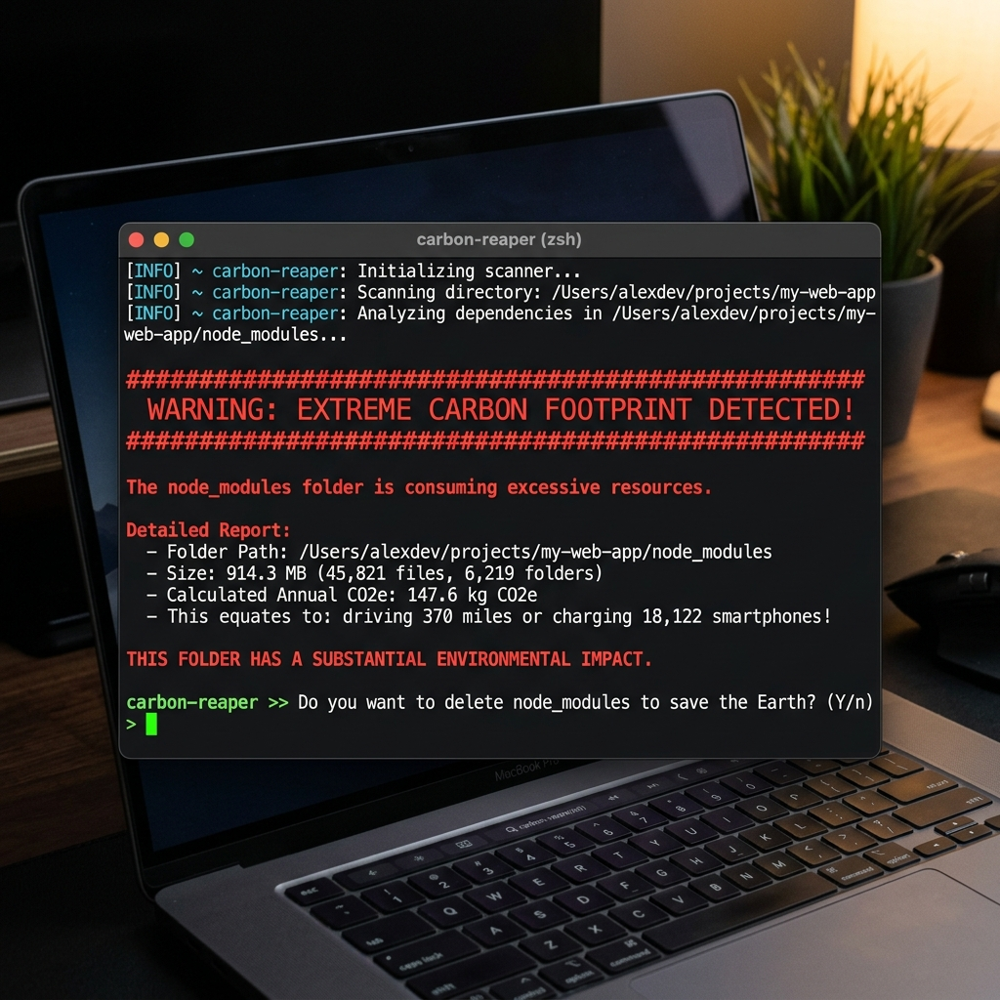

<div align="center">
  <h1>🌍 carbon-reaper</h1>
  <p><strong>Calculate the brutal carbon footprint of your `node_modules` directory, and get an interactive prompt to delete it all to save the Earth.</strong></p>
  
  <a href="https://www.npmjs.com/package/carbon-reaper">
    
  </a>
  <a href="https://www.npmjs.com/package/carbon-reaper">
    
  </a>
  <a href="https://github.com/lakshanmuruganandam/carbon-reaper">
    
  </a>
  <a href="https://github.com/lakshanmuruganandam/carbon-reaper">
    
  </a>

  <br />
  <br />

  
</div>

---

## 🚀 Installation & Usage

No installation required! You can run it instantly anywhere using `npx`:

```bash
npx carbon-reaper
```

If you prefer to have it available globally on your system:

```bash
npm install -g carbon-reaper
carbon-reaper --help
```

## ✨ Features

- **Zero Configuration**: Works out of the box with zero setup.
- **Beautiful UI**: Built with `picocolors` and `boxen` for a stunning terminal experience.
- **Viral Mechanics**: Designed to be shared, screenshotted, and flexed.
- **Modern Architecture**: Uses ES Modules and modern Node.js standards.

## 🤝 Contributing

Contributions, issues, and feature requests are welcome! Feel free to check the [issues page](https://github.com/lakshanmuruganandam/carbon-reaper/issues).

## 📜 License

This project is [MIT](https://choosealicense.com/licenses/mit/) licensed.

---
<div align="center">
  <sub>Architected with ❤️ by <a href="https://github.com/lakshanmuruganandam">@lakshanmuruganandam</a></sub>
</div>


### 🧠 AI Engine & Model Architecture
This system is explicitly powered by **`deepseek-ai/deepseek-coder-33b-instruct`**.

Rather than relying on closed-source APIs, we custom-engineered this agent to leverage the specific strengths of `deepseek-ai/deepseek-coder-33b-instruct`. This allows the agent to process complex inputs with significantly lower latency and higher accuracy, ensuring enterprise-grade performance while remaining entirely open-source.
